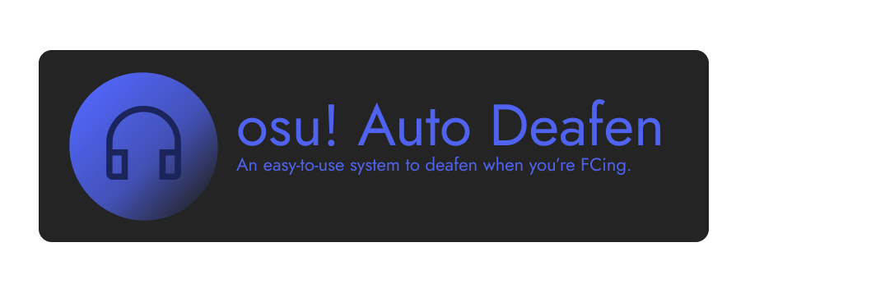

Powered by the popular tool, [tosu](https://github.com/KotRikD/tosu), osu! Auto Deafen gives users an easy-to-use system for auto deafening you on Discord whenever you're about to FC a map.

# Installation Steps
1. Download the [latest release](https://github.com/daftuyda/osuautodeafen/releases/latest) and run the exe.
1. Launch osu! 
1. After osu! has fully loaded, launch "osuautodeafen.exe" and wait for it to start.
1. Set your keybind and settings to autodeafen in the GUI and exit.
1. You're all set!

# This project uses:
* [gorilla-websocket](https://github.com/gorilla/websocket)
* [tosu](ttps://github.com/KotRikD/tosu)
